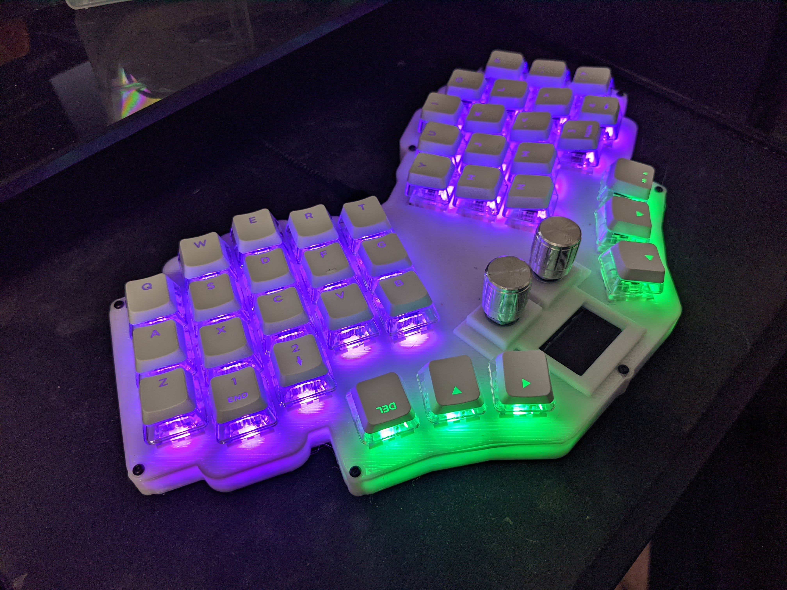
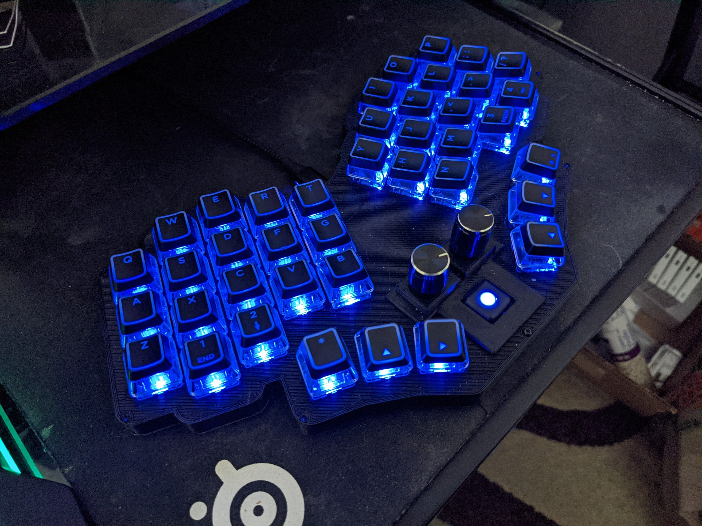
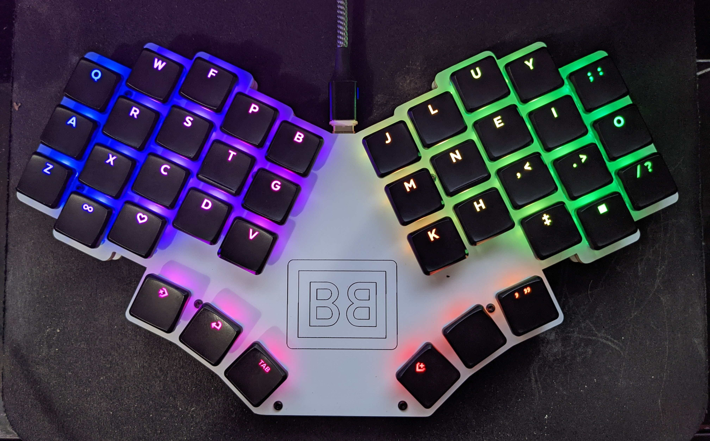
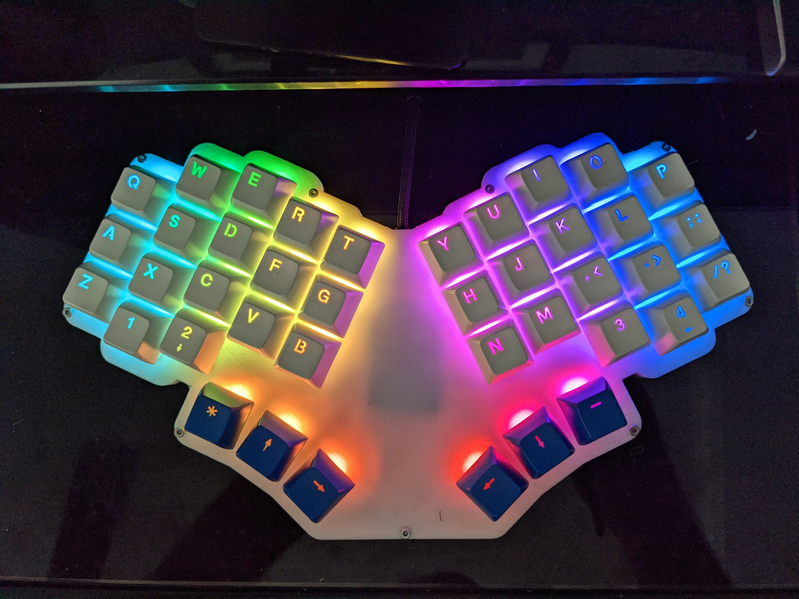

# Pronunciation

Bar-oh-board

# Support me!

I have spent a lot of time and money designing prototypes, testing, developing, etc. Any contributions would be greatly appreciated!

# Overview

This is a split monoblock keyboard with 40 keys, a 25% typing angle, and other goodies. Feel free to use for personal use, but any selling or reselling of this is prohibited without explicit consent.

There are three versions of this board. I have personally fabricated and tested the mx and the choc versions. I have not tested the byo-mcu version, but it's the same wiring as the mx version (and much simpler). It should work fine.

See the build guide, descriptions of the three versions, and BOM for all three here:
https://github.com/sadekbaroudi/barobord/blob/master/BUILDGUIDE.md

# Images

## v1-mx

## v1-choc

## Prototype

