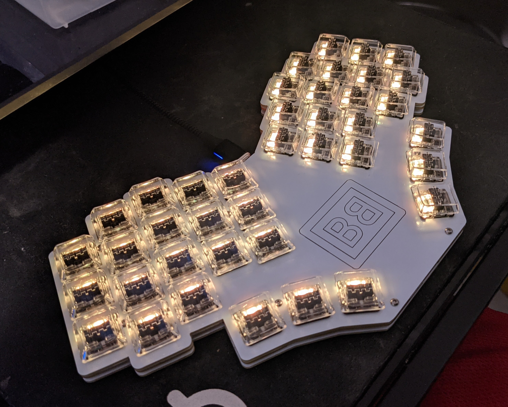

# Pronunciation

Bar-oh-board

# WARNING

The byo-mcu version needs to be reworked. Do not fabricate it. I accidentally used the RAW pin as a data pin, and I would like to add a jumper for the nice nano.

In theory, you can fabricate it as is and reroute the pin on the board to another unused pin on the MCU, then write your own firmware. However, unless you have expertise in electronics, I recommend waiting until I fix it.

# Support me!

I have spent a lot of time and money designing prototypes, testing, developing, etc. Any contributions would be greatly appreciated!

If you don't want to, or can't afford to support me, please send me a message to let me know you've built one, along with pictures. Also, feel free to submit a pull request with pictures into this repository. I'd be happy to showcase your build.

Reddit: /u/sadekbaroudi
Discord: sadekbaroudi#1258

# Overview

This is a split monoblock keyboard with 40 keys, a 25% typing angle, and other goodies. Feel free to use for personal use, but any selling or reselling of this is prohibited without explicit consent.

There are three versions of this board. I have personally fabricated and tested the mx and the choc versions. I have not tested the byo-mcu version, but it's the same wiring as the mx version (and much simpler). It should work fine.

See the build guide, descriptions of the three versions, and BOM for all three here:
https://github.com/sadekbaroudi/barobord/blob/master/BUILDGUIDE.md

# Do you want to test the layout?

Print the file below on a sheet of paper. Test it out!

[Layout tester](layout-tester.pdf)

# Firmware

I have not yet merged the barobord qmk firmware into the main qmk repository, but you can access it here:
[Barobord QMK firmware](https://github.com/sadekbaroudi/qmk_firmware/tree/master/keyboards/xoiviox/barobord/keymaps)

# Images

## v1-mx

## v1-choc

## Prototype

