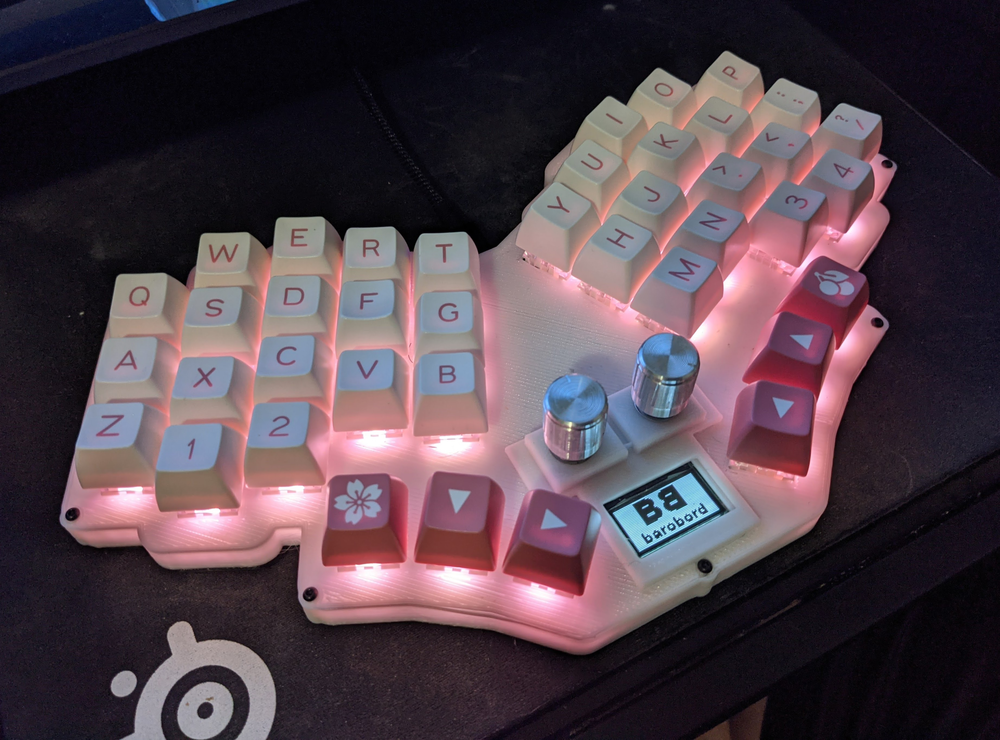

# Pronunciation

Bar-oh-board

# Overview

This is a split monoblock keyboard with 40 keys, a 25% typing angle, and other goodies. Feel free to use for personal use, but any selling or reselling of this is prohibited without explicit consent.

# Images

## v1-mx

## v1-choc

## Prototype

