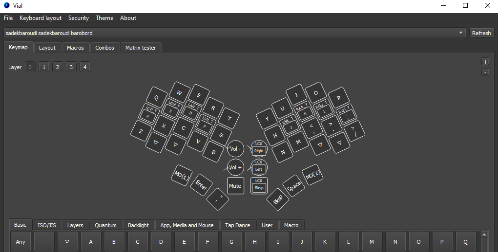

# Firmware

Depending on the features on your keyboard, download the appropriate firmware (.hex file) from this directory and flash it onto your keyboard.

Once you have done that, make sure you have [Vial](https://get.vial.today/) installed. Run it and configure it as you like!

If you want to change the firmware, the original source can be found [here](https://github.com/sadekbaroudi/vial-qmk/tree/vial/keyboards/xoiviox/barobord)

Here is what it should look like:

